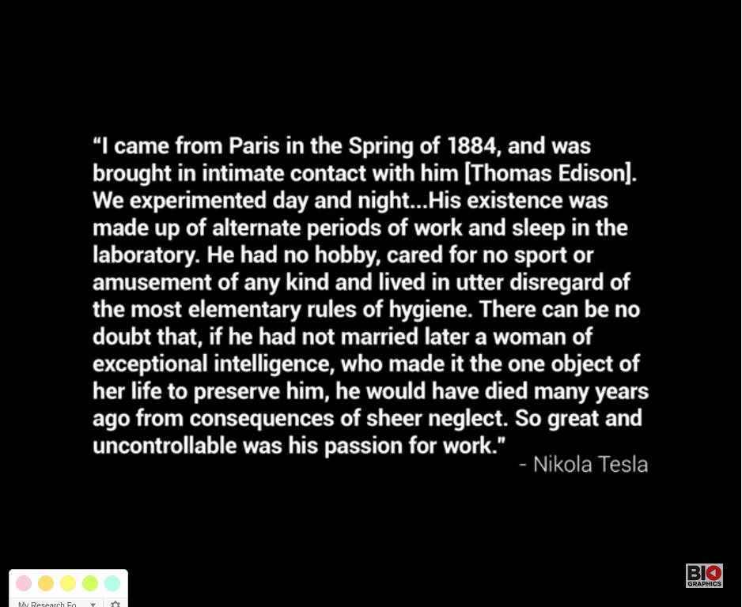
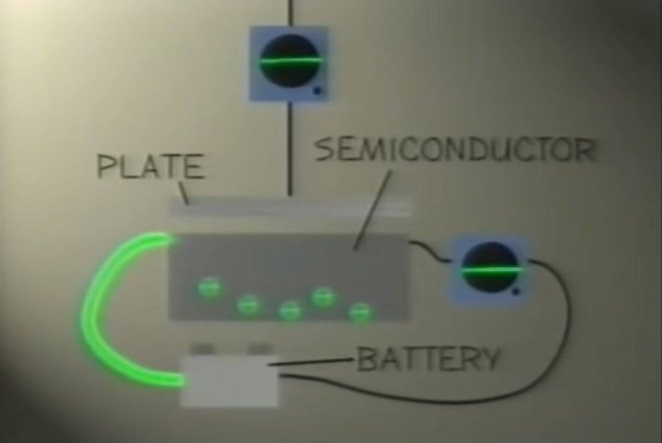

<link rel="stylesheet" href="../../../assets/markdownStyle.css">

<link rel="stylesheet" type="text/css" href="/media/user/16GB/ProjectStarterNeo/Notes/assets/markdownStyle.css">

<table class="wikitable">

<tbody><tr>
<th>Name
</th>
<th>First operational
</th>
<th>Numeral system
</th>
<th>Computing mechanism
</th>
<th><a href="/wiki/Computer_program" title="Computer program">Programming</a>
</th>
<th><a href="/wiki/Turing_completeness" title="Turing completeness">Turing complete</a>
</th>
<th>Memory
</th></tr>
<tr>
<th><a href="/wiki/Difference_Engine" class="mw-redirect" title="Difference Engine">Difference Engine</a>
</th>
<td>Not built until the 1990s
</td>
<td><a href="/wiki/Decimal" title="Decimal">Decimal</a>
</td>
<td><a href="/wiki/Mechanical_engineering" title="Mechanical engineering">Mechanical</a>
</td>
<td>Not programmable; initial numerical constants of polynomial differences set physically
</td>
<td>No
</td>
<td>Physical state of wheels in axes
</td></tr>
<tr>
<th>Analytical Engine
</th>
<td>Not yet built
</td>
<td><a href="/wiki/Decimal" title="Decimal">Decimal</a>
</td>
<td><a href="/wiki/Mechanical_engineering" title="Mechanical engineering">Mechanical</a>
</td>
<td>Program-controlled by <a href="/wiki/Punched_card" title="Punched card">punched cards</a>
</td>
<td>Yes
</td>
<td>Physical state of wheels in axes
</td></tr>
<tr>
<th><a href="/wiki/Bombe" title="Bombe">Bombe</a> (Poland, UK, US)
</th>
<td>1939 (<a href="/wiki/Bomba_(cryptography)" title="Bomba (cryptography)">Polish</a>), March 1940 (British), May 1943 (US)
</td>
<td><a href="/wiki/Character_(computing)" title="Character (computing)">Character</a> computations
</td>
<td><a href="/wiki/Electromechanics" title="Electromechanics">Electro-mechanical</a>
</td>
<td>Not programmable; cipher input settings specified by patch cables
</td>
<td>No
</td>
<td>Physical state of rotors
</td></tr>
<tr>
<th><a href="/wiki/Z3_(computer)" title="Z3 (computer)">Zuse Z3</a> (Germany)
</th>
<td>May 1941
</td>
<td><a href="/wiki/Binary_numeral_system" class="mw-redirect" title="Binary numeral system">Binary</a> <a href="/wiki/Floating_point" class="mw-redirect" title="Floating point">floating point</a>
</td>
<td><a href="/wiki/Electromechanics" title="Electromechanics">Electro-mechanical</a>
</td>
<td>Program-controlled by punched <a href="/wiki/35mm_format" class="mw-redirect" title="35mm format">35 mm film</a> stock
</td>
<td><a href="/wiki/Z3_(computer)#Z3_as_a_universal_Turing_machine" title="Z3 (computer)">In principle</a>
</td>
<td>Mechanical <a href="/wiki/Relay" title="Relay">relays</a>
</td></tr>
<tr>
<th><a href="/wiki/Atanasoff%E2%80%93Berry_Computer" class="mw-redirect" title="Atanasoff–Berry Computer">Atanasoff–Berry Computer</a> (US)
</th>
<td>1942
</td>
<td>Binary
</td>
<td><a href="/wiki/Electronics" title="Electronics">Electronic</a>
</td>
<td>Not programmable; linear system coefficients input using punched cards
</td>
<td>No
</td>
<td><a href="/wiki/Dynamic_random-access_memory" title="Dynamic random-access memory">Regenerative capacitor memory</a>
</td></tr>
<tr>
<th><a href="/wiki/Colossus_computer" title="Colossus computer">Colossus</a> Mark 1 (UK)
</th>
<td>December 1943
</td>
<td>Binary
</td>
<td>Electronic
</td>
<td>Program-controlled by patch cables and switches
</td>
<td>No
</td>
<td><a href="/wiki/Vacuum_tube" title="Vacuum tube">Thermionic valves (vacuum tubes)</a> and <a href="/wiki/Thyratron" title="Thyratron">thyratrons</a>
</td></tr>
<tr>
<th><a href="/wiki/Harvard_Mark_I" title="Harvard Mark I">Harvard Mark I</a>&nbsp;– IBM ASCC (US)
</th>
<td>May 1944
</td>
<td>Decimal
</td>
<td>Electro-mechanical
</td>
<td>Program-controlled by 24-channel <a href="/wiki/Punched_tape" title="Punched tape">punched paper tape</a> (but no conditional branch)
</td>
<td>No
</td>
<td>Mechanical relays<a href="#cite_note-44">[44]</a>
</td></tr>
<tr>
<th>Zuse <a href="/wiki/Z4_(computer)" title="Z4 (computer)">Z4</a> (Germany)
</th>
<td>March 1945 (or 1948)<a href="#cite_note-45">[45]</a>
</td>
<td>Binary floating point
</td>
<td>Electro-mechanical
</td>
<td>Program-controlled by punched 35&nbsp;mm film stock
</td>
<td>Yes
</td>
<td>Mechanical <a href="/wiki/Relay" title="Relay">relays</a>
</td></tr>
<tr>
<th><a href="/wiki/ENIAC" title="ENIAC">ENIAC</a> (US)
</th>
<td>July 1946
</td>
<td>Decimal
</td>
<td>Electronic
</td>
<td>Program-controlled by patch cables and switches
</td>
<td>Yes
</td>
<td><a href="/wiki/Triode" title="Triode">Vacuum tube triode</a> <a href="/wiki/Flip-flop_(electronics)" title="Flip-flop (electronics)">flip-flops</a>
</td></tr>
<tr>
<th><a href="/wiki/Manchester_Baby" title="Manchester Baby">Manchester Baby</a> (UK)
</th>
<td>1948
</td>
<td>Binary
</td>
<td>Electronic
</td>
<td>Binary program entered into memory by keyboard<a href="#cite_note-46">[46]</a> (first electronic stored-program digital computer)
</td>
<td>Yes
</td>
<td><a href="/wiki/Williams_tube" title="Williams tube">Williams cathode ray tube</a>
</td></tr></tbody></table>

# [Birth of The Transistor: A video history of Japan's electronic industry. (Part 1)](https://www.youtube.com/watch?v=ihkRwArnc1k)

Transistor 
the telephone: Alexander Grayham Bell invented the telephone was in high demand and created a lot of revenu which sponsored other inventions.
the vaccume had a short life expectancy and was expensive. the transistor replaced it. 1948 bell publishesdiscover of the solid state amplifacation phenomenon using germainium. it went unnoticed by the public.

Makto kikuchi member of the technicla lab.
civil information and Education section of the allied forces is where japanese leart about american tech and culture

japanese studied the transistor and developed their own versions. they had no knowledge of solid state phenomenon. they failed to do it.

William G. PFann
germainium refine methods zone refining. memorable event. Tohoko university. graphite, hydrogen gas. cooling system. same as large microwave. germainium melts. purity crystals are left behind. 

---

# [Relay - Wikipedia](https://en.wikipedia.org/wiki/Relay)
1824 electromagnetic

1831 joseph hamering electromagnetic relay. wasnt a commutatioin relay.

n 1809 Samuel Thomas von Sömmerring designed an electrolytic relay as part of his electrochemical telegraph.[1]

American scientist Joseph Henry is often claimed to have invented a relay in 1835 in order to improve his version of the electrical telegraph, developed earlier in 1831.[2][3][4][5]

Telegraph relay contacts and spring
It is claimed that English inventor Edward Davy "certainly invented the electric relay"[6] in his electric telegraph c.1835.

A simple device, which is now called a relay, was included in the original 1840 telegraph patent of Samuel Morse.[7] The mechanism described acted as a digital amplifier, repeating the telegraph signal, and thus allowing signals to be propagated as far as desired.[7]

The word relay appears in the context of electromagnetic operations from 1860.[

# [History of Computers part 1 BBC Documentary.mp4](https://www.youtube.com/watch?v=6dME3wgaQpM)

prgrams for the cambridge machine used punch cards. scientists learnt ho wto make program

1 machine could do -10,000 humans with calculators
3 machines could do all the scintifici computing in britiain

they discovered that it opended new possibilities such as radio astronomy which generated masses of data.
other branches of science which needed the calculations. computing  as a tool to widen thier horizons. newspater writers wanted to believe that there was more to it. Alan turing knew thaere was more to computeres thnan number crunching.
Alan turing buuildt one of the first stored program computers. british mathematician. craced the german codes. 1936 published a mathematical problem. wrote about computing machines. and could any logical task a human coul do. saw it as a logical process which followed rules.one step by step process manipulating symbols by certain rules. code breeaking took symbols and transformed to unscramble a message with letters. when war broke out he tested his ideas. it's existence wasnt revealed until the 1970's. the encoding of germans in ww2 relied on machines. enigma encoded the day to day traffic of the forces. Turing cracked it. some from Hitler were sent using Lorentz cipher. breaking it was difficult and would require a computer. the collosus. it computed not numbers. but letters. it developed the same year eniac did. the eniac vaccume tubes carried out arithmetic. colossus broke so many top secret messages and helped to win the war. had less impact on computer development but it proved that computers could be more than number crunchers.

Turing wanted to simulate human thought. He went to Manchester university 1954 commited suicide. 

Eckhart and Mockley 
people were skeptical about the use of a computer, it needed a vaccume tube. if you could run it out without it burning for an hour you were lucky.
Finding customers, who'd want to buy.

you needed an advance  understanding of logic that the average person couldnt use it. they looked for a customer. the us bureau were drowning in records. they had a census in a few years and needed one. record keeping had been around for a century, using punch cards and workers to slave away. it was slow and tedious. they tried to convince the census bureau that one computer could replace all the workers. they were given $350,270.00 for the project. They were optimistic. They named it UNIVAC. within a few months, they realised that they had underestimated the time and effort required to pull it off and fell into debt. it want enough money to develop it. they spent a lot on magnetic tape and other ingredients. 

j Lyons company corner houses. it was a large scale food manufacturer. tea and cakes  started the computer industry in britain. They were in a mathematical background and heard about the application of computers. in 1947 computers weren available. so they decided to build thier own. They wanted to use it outside of the laboratory. by the end of 1951, the work of 400 clerks were replaced by  LEO (Lione Electronic Office).

Its programmers thought of novel tasks for them. program that would take orders. and would calculate demand and supply based on the weather???

1948 Ekert built the UNIVAC while Mortly looked for more financial backing. by this time were in business in two years and were still behind schedule. Mortley looked for more sponsors. American Totalisater company, who made the  mechanical equipment that calculated the odds at racet tracks. Strouse wanted to replace their machines. Strouse purchased a 40% of the debt. he died in a plane crash in 1949. without backing the company went into debt. The went to Remington Rand. who sold typewriters, punchcards tabulating machines and electric shavers. Rand wanted to get into Electronics. and Now belonged to Rand. It was little noticed by the company. Rand launched a public relation plan and CBS were convince to win the Lyons share of the election night audience was for univac to forecast the results in 1952.   
the first time a computer predicted the results of an election. it soon started appearing on the tube. by 1953, there were 3 univacs installed and more coming in. there was no competition even from IBm

in the 1940,s the company didnt see the need for computers. they didnt recognise it when it was coming. Tom watson jnr started to panic and tried to convince with pappy to invest in computers. but pappy saw no comercial future in these fangled machines. they were market driven, but needed to drive the market. the developed computer's for businesses. Univac were stealing customers from IBM. they launched the ... in 1953. used to run in conjunction with punch cards. his sales force were his trump card. he rewarded them with high commisions and punished them if they didnt meet their quota.

within a year IBM was able to surpass Remington. this threatened the British industry too. the British Tabulater company, later all the major british companies merged to take on IBM. 

in the 1950, the problem was software development. and could cost 2-3 times more than the computers themselves. the computers were sitting idle while programmers struggled to write programs in binary. it was tedious and error prone 1949 ASM. it was not attractive. A computer without software is like a car without a driver??? not anymore!! there was a shortage of programmers. without software the computer was useless. programming needed to be made easier. so they created Fortran. it allowed mathematician to write formulaes the way the would do normally. businesses didnt fine Fortran useful, and turned to Cobol 1959. it was very english like and was eaiser to use. with the compiler they could convert the language into binary.

most computers were found in administrative offices which replaced clerks.

computers started starting up in factories. increased automation was putting workers at risk of losing jobs. there were mixed feelings in the public. 

the bank of america employed 2500 book to calculate checking account. whose job was to process 9million checks per day. the perfect job for a computer

1961, Regan was the commercial spokesman for the Generals electric which made the banks computer. ERMA (Electronic Recording, method of Accounting). an accountant can sort 250 accounts per hour. Erma can sort 550 accounts a minute and was error free. magnetic characters on the checks could easily be read by machines and transferred to magnetic tape. it was 100 times faster then humans and error free. displacing thousands and opend other jobs that were created that werent as boring as being a book keeper. the fear of machines replacing humans was replaced.

computers gobbled up valves as quickly as manufacturers could produce them

the transistor

john bardine , walter Bataine, william shockley won the nobel prize in 1956. the same year the first transistor went into production. and replaced the vaccume tubes.  it was a 50th the size. a fraction of the electrical power, 100 times less the weight. no heat.

1962 the atlas, could calculate 1million instructions per second. connecting the components created a nightmare. it became the tyrrany of numberrs.until this was soved, computers more complex than the atlas were difficult to envisage.

the answer was the integrated circuits. Geofry Dummer first suggested it in the early 50s. but the Fairchilde semiconductor produced the first manufactured IC. made from 1 piece of silicon. chemically treating the silicon made electronic components such as transistors. to wire everything, a layer of metal was evaporated onto the structure. the tyrrany of numbers was solved. no longer was it needed to solder and wire components. 1959 it was advertised, but computer firms didnt pay it any mind. it was too expensive. but there was no takers. 

how could they put a computer ontol an aircraft if it couldnt even fit three astronauts and computers like the atlas weighed 20 tonnes. The pentagon were willning to pay any price. Electronics firms then started seeing the values of IC's. unlike the hand wired transistors. IC's could be massed produced and prices plummeted. murphy's law. the smaller the more reliable and cheaper and better. before this it was likke monks hand copying scripts as opoposed to the printing press which could produce thousands. within a decade the price of IC's had dropped to pennies.

electronic grew an dcalifornia region silicon valley was born. 300 electronics firm in a 30 sq mile area. 

8 years after John's Kennedy's challenge Nasa's onboard computer built from IC's was completed and was the smallest computer ever built. The life of the passengers depended on it 72 hours after blast off, they'd have to use the computer to maneuver onto the dark side of the moon without mission control.

by that time they were still programming with punch cards and which were difficult to program in. sometimes you had to leave it over night. and wake up to see that it didnt finish executing because of a simple mistake.

sutherland created the power of interacting with a computer with sketchpad was the first program used to draw onto a computer using software. it didnt start a big movement as they didnt see the value. a few years later Dug angelbart appealed to his colleagues to think of a different way to interact wit the computer demosntrating the use of a mouse. commercial companies didnt see the use of such a device. one of the implications of the mouse wass paperles communication.  which didnt go unnoticed.

Zerox cooperation owed its prosperity to paper copying. in a visionary act they funded zerox park for 10 years. gathering some of the best computer scientists. to make computers easier to use by the ever day person. they knew that they had too much technical knowledge to find the need to the average user.

The younger generation felt left out of the computer revolution as one computer could cost as much as  a house. Steve wosniac and steve jobs took computers to the next step, putting computers into the hands of common person. the ansewer was in how children learn piaget 1-4 learning through touch 5-6 visual aspect is more importnt and can lead them into error e.g. the amount in different shaped glass with the same volume. later we learn to handle symbolic info with difficulty. many people find difficulty with algebra. but were all good at manipulating with our hands which was the key to manipulating computers. they used the mouse and one could use it to simulate a world the user already was used to like paining apps. and text editors or music. software changed the computer to a mental tool. they created the user illusion, e.g. games to create the illusion of another world simulated by a program. they could create a virtual office with folders and documents and file cabinets. instead of the user learning unfamilliar terms they used what already existed in the physical world. xerox demonstrated the future in the early 70's but it was too expensive for the average user $45K dollars. nobody heard of it becuse it wasnt made into a successful product. they were a copier company not a computer company. they werent ready to launch into the computer industry. but it would have to be smaller and cheaper.

1970'S silicon. computers which once filled into a room fitted onto a chip which could be mass produced. it changed the economics of computing. microprocessors mass produced can become disposable as they got cheaper. it like a light bulb, when it burns out you just throw it away! no need to solder it again. IBM didnt see the mass market potential of computers and only saw industrial purpose. technical hobbists before the microprocessor couldnt do this without the microprocessor now things would change. 1975 popular electronics Altair $500 which had  to be assembled but it didnt do anything. many got their kits. 

this was dream come true for the technical hobbist. 
the home brew computer club showd ff what they got their computers to do.startups started selling parts for the altair. by 1976 there were enough members to hold a convention in atliantic city. 2 of them sold circuit boards. steve jobs and wosniac were high tech pracsters. they built blue boxes to make free phone calls. wassniac was the best hardware designer. and steve thought about the business aspect. how could the thing be marketted. they went to mike Markler who liked helping entrepreneurs. They showed him the apple. the two didnt have the background to start by themselves. 

some people used it for games and later scientific and business uses were found, many folded. apple prospered becoming the fastest growing company. each ended up with over 100M 	dollars. they finally made the computer available to everyone. 

The new market was dominated by the americans. if it can be reduced then the market could be expanded. Sinclair used to make cheap electronic gadgets, tiny televisions, to calculators. 1980 launched it's first computer, and colld be plugged into any tv. programs were sold on cassets. it took over most of the british market. 

IBM had been sitting on the sidelines watching and didnt know how to enter the market. they put out a pc in 1975, the 1500 portable computer, cost 5000 to open the box and 9000 for it to do anythng. they were selling this at computer fair but didnt do much business. 

1981 put out a personal computer and dominated the market. they were cheap and affordable but were still difficult to use. what the pc revolution needed was software even for a child to use. Steve jobs sold the ideas 1979 he visited xerox and was astonished by what he saw. thier vision now became his vision. to build a computer that all could use easily. 1984 was the release of the apple mentioning orwell, his rivals were IBM, big blue who were dominating the whole industry in his speach.

Jobs created a reference to big Brother in reference to the whole world's computer industry being run by IBM. w

they used the ideas of graphical user interface created by programs and the mouse-. prior to this computers were mainly command line interface. they were now simple to use and were userfriendly. it could now be used for several things like calculation, drawing, music, flight simulator, games, office software. the user was limited by his imagination. it then started moving away with the historical relation to calculating numerical machines. it now became multi purpose machines that can be turned to do anything. 

# [Cinema, Radio, and Television: Crash Course History of Science #29](https://www.youtube.com/watch?v=go3AwYghhdI)

the telegraph

1876 telephone
late 1800s the television
1877 edison phonograph (sound writing)
the record was made and were preferred. over the phonograph as they  
1888 Le prince the inventer of motion pictures, he then disappeared from a tran iand was never seen again. Edison was the napoleon of technology,  with william dixon who invented the kinetograph. give the illusion of motion. kinetoscope by edison. the kinetophone to add sound to the pictures they were only 1 minute long. "professor welton boxing cats". electrifying an elephant with electricity AC. Edison had the patent on cameras and made some enemies so they had to leave to los angeles the epicenter of the movie industry as he kept sueing movie makers. 

As with many innovations, the idea for the telephone came along far sooner than it was brought to reality. While [Italian innovator Antonio Meucci](https://www.elon.edu/e-web/predictions/150/1870.xhtml) is credited with inventing the first basic phone in 1849, and Frenchman Charles Bourseul devised a phone in 1854, Alexander Graham Bell won the first U.S. patent for the device in 1876. Bell began his research in 1874 and had financial backers who gave him the best business plan for bringing it to market.

1890 Louis Lumier Eguste, cinematograph for mass screening. the us ruled out edison holding the patent on all movie cameras. radio came out decades after movies. 

1860's Scotish james clark maxwell predicted the existence of radios

---

1885 [Heinrich Rudolf Hertz](https://en.wikipedia.org/wiki/Heinrich_Hertz)  discovered that a wire carrying electric current will radiate and give  off electic waves if it swung back and forth. he made an antenna. he showd how to make and detect electromagnetic waves which led to the radio measured in herts. megaherts gigaherts etc.

(/hɜːrts/; German: [ˈhaɪ̯nʁɪç ˈhɛɐ̯ts];[1][2] 22 February 1857 – 1 January 1894) was a German physicist who first conclusively proved the existence of the electromagnetic waves predicted by James Clerk Maxwell's equations of electromagnetism. The unit of frequency, cycle per second, was named the "hertz" in his honor.[3]

---

1890s Gugliemlo Marconi was inspired by Hertz work engineer italian, inventer. worked on how to send telegrams wirelessly. many were interested but he was the first successful. went to britan to commercialise his system. 1899 he sends the first wireless telegraph signal accoss the english channel. 

1901 from england to New finland canada sent the letter 's' accross atlantic.

marconi won the nobel prize

Nicola tesla worked on radio before but marconi was more successful. 

1936 3/4 of americans owned a radio. this and tha automobile changed the world. a way to spread news and propaganda.

1920's John Baird Television 
1924 first televised images of only 30 lines
1926 moving images.
1928 transmitted an image of the human face across the atlantic.

tv's were expensive and so were recievers so it didnt kick off until the 1940's.

1969 they went to the moon. 

the big dons
Standard Oil
General Electric
Dupont
Bell Labs
IBM Labs
Google X 

# [The True Story of Nikola Tesla Pt.2](https://www.youtube.com/watch?v=Iie8U5rngwA)
[^1]
1885 Tessla began to redesign tessla's motors which were inefficient, and didnt spark and were more reliable. they are still used today. Edison said he was joking. and left edison's company.

electrical revolution was about to change the whole planet. billion dollar industries emerged out of nowhere. Tessla joined the electrical revolution. searchng for investors. he was working for $50 to dig ditches. he established a relation with partnership with George Westinghouse Jnr (wasnt a good student) but said the best education he had was for working for his father(see other vid!!) George putting him at competition with edison. AC current was enough to power the whole world as it could be transmitte alogn long  distances.

1893, there were many patent suppression and shady business deals, Edison weilded over Tesla's inventions. the war of the currents reached it's peak. 

school boys were being paid schoolboys to steal pets. and he publicly executed them with AC. publicly to prove that it was dangerous. he aided in the created with AC. Tesla showed that it was safe by allowing Current to flow through him to produce light at 1893 world fair. AC became popular and became preferred over DC. eh was loved by citizens because he made life eaasier. Edison became more dispised by other in General Electric and lost control after several mergers. Tesla designed Ac motors, generators, transformers and power transmission technologies resulting in 25 in the most valuable pattents which we still use till today. but he was just getting started. 

Things tessla invented
1893 Radio: wrongfully attributed by marconi
1898 Tesla used radio to control a boat. when marconi sent the first translanlantic message
'marconi is a good fello, let him continue, he is using 17 of my patents' said tesla.

Tesla discovered x-rays  before Wilhelm Rumchen, and was aware of the dangers of using it. it was helieved that it could cause blindness. Edison, used it on his employees who died from cancer. he also fired xrays into his own eyes. 

hydro-electricity
using waterfall to generate electricity. even from childhood he knew that it could. 

the earthquake machine. pocket sized machine. planted to a buildings natural frequency, made the building wobble. if he had 10 minutes could level . he figured out the resonance of the earth.

wardencliff tesla tower. which could transmit power.using the ionosphre. JP morgan shut down the project when he thought it wouldnt make any money? but the truth is he pulled out when marconi sent out the first radio wave. Tesla sold the project to morgan as a wireless transmission tower. 

by this time maxwell's equations wern't available yet.

# [Episode 39: Maxwell's Equations - The Mechanical Universe](https://www.youtube.com/watch?v=SS4tcajTsW8)

history of science, most historians egnore it becasus they dont understand it. 

James Clerk Maxwell, Mathematical theories. his precisous books, rolling hills of glen hill 2 days journey from edinborough, and Catherine his lovergirl. went to teach in 1856.

Newton wrote a book about expressing natural forces. gravity which would later b coupled with electricity, and megnetism

michael faraday, had been drawn to 1831. had been drawn to electromagneticism. an electric field could produce current. changing electric current in one circute couild induce electric current in another. similar discoveries by american joseph heinrich. this birth the theory electricity and magnetism induction. faradays experimental in electricity was holy to maxwell. he later on drew new conclusions as he was a mathematician. cambridge mathematician. as a graduate students. he wrote on "faradays lines of force". later wrote "thoughts on ray vibrations". he speculated that light is a vibration in the lines of force which combine particles mass. electric charges were linked together by lines of force in empty spasce. it introduced an interesting scientific question. "would a vibrating charge set the lines of force into vibration"

electromagnetic theory of light.
before that maxwell needed to decipher a crucial clue. he found a significant speed. any wave has a definite speed depending on what is letting it go? e.g. deep water the length of gravity and length of wave. air airpressure and density of medium. linked oscilators, spring constatn, mass and distance between osciliators. basically variables that affect the wave in ever different environment. so he needed to calculate the variables in faradays lines of force. electricity and magnetism, each with it's specific constants

k sub e is related to k sub m

c=3x10^8 m/s

maxwells moved to england londons royal institution kensington london 1860. kinetic theory electricyty. at londons royal instution met faraday, who saw electricity in mechanical terms. Maxwell saw the real image. the medium was the electromagnetic fields. he needed to find out if the force could travel at the speed of light. they'd have to obey the 4 laws of electricity and magnetism. 

Gausse Laws.
Ampere's law
Faraday's law of electromagnetic induction

magnetic wave must tag along with the electric wave wherever it goes. this can only be true if there is current flowing through according to amperes law. in empty space thre is no space. according to the mathematics in maxwells time, there could be no electromagnetic waves in space. could those laws be incomplete? Maxwell was determined to find the missing piece. he looked to the capacitor. the Farad! the only. maxwell looked at faradays book, changing magnetic flux creates electric circulatin. could changing electric flux create magnetic circulation? looking at things the other way. charge builds up in a capacitor. it can be deduced with gausses law.  

he successfully discovered the equation in which changing electric flux cna generage am electric field. the displacement current.

---

# [Transistor Full Documentary - YouTube](https://www.youtube.com/watch?v=U4XknGqr3Bo)

1907 AT&T were in financial crisis, would offer customers coast to coast transmission. they needed an amplifyer to boost the signal. The Lee deforest made the 
1906 made the vaccume tube.  

1915, they started transmitting phone signals. 
vaccume tubes like their cousin the light bulb burnt out quickly.
the answer was silicon and germainium. WW2 put kelly's plans on hold. radar helped them track ships, see through fog and darkness. and helped to develop the transistor as it used silicon and germainium.
they required switchboard operators. the company found it hard to keep up. long distance calls could be routed automatically if a reliable switch could be found. Kelly hired Shockley to lead the team. brilliant theorist but not good with his hands. Walter Brandon was a good experimental physicist. Jean bardine, who understood the semiconductors. entered college at the age of 15.

Shockley:theorist
Bandon: experimental physicist
Bardine:semiconductor 

1945 Bell Labs, AT&T hired the company's top scientists. 

# [The Vacuum Tube and the Invention of Radio - YouTube](https://www.youtube.com/watch?v=0UKCUMghTrc)

the radio brought about the birth of the electronics revolution vaccume tubes made radio technology.

a radio is waves sending modulated patterns. if you send electricyty through a wire it will emit electromagnetic energy, send it with high energy and it will travel far. it was called hertzian waves. but onoone knew how to use them. they were often told it was a result of induction rather than electromagneticism. Marconi wanted to use the hertzian waves commercially. 

it uses crystal used as a semiconductor.AM. Amplitude modulation. the crystal removes one side of the radio wave which without would cancel itself out as waves would cancel them out. Crystal radios didnt work well. they needed to be louder and work better. Edison rediscovered the principle that made vacume tube good for radio. Edison Effect/ now Thermionic emmision.

Lee deforest. took Flemming's diode and added a third element, calling it the triode. whichi was a control grid between anode and cathode. you can turn on and off the electrons, that's why they are called valves 

# [A Brief History of Radio Devices 1900-1927 - YouTube](https://www.youtube.com/watch?v=Y-A9wrL88nM)
Bob Jensen
Broadcasting and recieving equipment, in the radio business all his  life. pioneer was father of radio
1906.
was difficult to predict where technology was going to go.

spark transmitter, with spark coil similar to fort coil used by experimenters in 1915, transmit signals across the room reciever was a tube with nikel  and iron filing as the radio signal went through the filings would cohere and change the reistence of the circuit and ring a bell was known as a coherer. change the radio waves to audi waves. there were many forms. carborandum detecter, sulpyuric acid detector

1925 they made the crystal detector. gelina could be purchased at the store. you'd wind the coil, and headphones, youd turn and manipulate it find on the crystal where you can hear. the crystal detectoer was the oldest diode. 1915 radio, coil made a spark antenna, tranfer switch, reciever coil, crystal detecter, signal generator had a range of 5 miles. spark box, transmitter. 1000watts, created a fluid arch with alchohol, voice transmitter done by modulating an arch transmitter.

1904 flemming
1907 deforrest invented the triode
armstrong regenerative reciever amplifying

westinhouse reciever, three vaccume tubes

1920 201A vaccume tube became the most popular

WD12
transformer
cbattery

# [Babbage's Difference Engine No. 2 - YouTube](https://www.youtube.com/watch?v=0anIyVGeWOI&t=2s)

1847-1849 didnt succeed. weighs 5 tonnes, consists of 8000 parts, bronze cast iron and steel. calculates and tabulates value of any 7th order polynomial, to 31 decimal places, high accuracy, and prints the results. impresses the result in plastic. to eliminate human error. worked by cranking. 28 separate cams determine the internal timing and orchestration of all mechanical parts. adds a 31 digit

---

# [1948 | Timeline of Computer History | Computer History Museum](https://www.computerhistory.org/timeline/1948/)

---

2012
Raspberry Pi

2011

Siri

2010

Tianhe-1A Supercomputer

China's Tianhe supercomputers are operational

2008

Bitcoin retailer logo

Bitcoin
Popular Culture
In 2008, “Satoshi Nakamoto,” likely a

2000

PlayStation 2 game console

Sony releases the PlayStation 2

---

# IMITATION GAME

1928
he was bullied at school, he really liked crossword puzzles.

turng wanted to work alone, saying the other men on the team would slow him down ( 6 others) 

159MMMpossible settings
every bombing attack were all floating through the air. radio signals could easily be intercepted but they were encrypted with the Lorentz cipher.

if 10 men checking 1 setting a minute for a 24 hours 7 days a week. it would take 20Million years.
they needed to decypher the settings in 20 minutes

he was reclusive, he excercised and built the machne using diagrams

they refused to fund his machine which cost £100K, his colleagues refused to work with him. The main commander (prime minister ) was william Churchill, he asked his boss to deliver a message to him. they put turing in charge. he immediately fired 2 of his colleagues cos they were mediocre mathematicians and linguists. 

he hired thers, giving them a crossword puzzle as a test for qualification. qualifyers. giving them 6 minutes to complete the task.  Joan clark was one of the qualifyers and finished it in under 6 minutes.

it is the people noone imagines anything of the things noone can imagine

he was almost accused of being a spy

1941
they turn on the computer, it didnt appear to work. the old man boss wanted to fire him. they wanted to stop the machine. the whole of his team backed him up. they asked for 6 more months, they got 1 month to make it work.

They discoveed that Chrostopher didnt have to search through every combination brute force. All they needed to do was find words that would be in the message. 
weather report.
'weather' & 'hail Hitler'

it had to be a secret.

a system to determine what intelligence to act on. which to act on an whih to let through. the minimum to win the war and the maximum before the germans would get suspicious.
they called it ultra, the largest store of military intelligence of the history of the world. 

ask it will be given you seek and you will find Mathew 7:7
he was blackmailed not to tell the authorities by his russian spy. if he did, he'd let his secret about being homo out.
He told his fiance, and she had her suspicions. he said he didnt care about her. she slapped him.
they performed thier calculus to determine which to work on and which to ignore

they won the war. they have never met before nor even heard the word enigma

his Friend Christopher was dead. he had tuberclosis.

cambridge master sentenced for indecency

breaking the enigma shortened the year by 2 years and saved 14M lives
he inspired a generation of machines called turing machines.

1957 USSR sputnick leading to the sputnik crisis. US felt inferior to the russians.
as a result US increased research and development leading to the space race. 
Darpa bilt the internet as a result. 
NASA.

# [Alan Turing: Crash Course Computer Science #15 - YouTube](https://www.youtube.com/watch?v=7TycxwFmdB0)

while he was a master student in cambridge
David hilbert's Entscheidungs problem (Decision problem) asked the question 
"is there an algorithm that takes, as input, a statement written in formal logic, and produces a "yes" or "no" ansswer that's always accurate?
if this were possible we could ask it questions like 
"is there a number that is bigger than all nmbers?" it could answer many mathematical questions

1935 Alonso Church proposed a mathematical question using lamda calculus and according to his calculations  there was no such algorithm

Alan turing came up with his own way to answer the question using a turing machine. Turing provided a simple yet powerful mathematicla model of computation. Although using totlly different mathematics, they were functionally equivalent to lamda calculus in terms of their computational power.

A turing machine is a theoretical computing device equipped with a infinitely memory tape with symbols with read and write. there is also state and rules that describe what the machine does. the rule could be to read the tape, write a binary. move left or right.

e.g.

num=...1111111111111111110
 
num isEven? write(1):write(0)

this is a general purpose computer.
turing machines are the best type of computers. most systems are turing complete. 

the halting problem.
"Is there an algorithm that can determine given a description of a Turing Machine and the input from its tape, Whether the machine will run forever or halt?"

is there a way to figure out if a computer will halt without executing it? Some programs could take years to run so it is something useful to know. Turing came up with a proof that the problem was unsolvable. using clever contradiction.

Program input , yes/no

Turing reasoned that "If there existed a program whose halting behavior was not decidable by the machine, It would mean the halting problem is unsolvable". Turing built another machine ontop of H (The machine in question). if A says that the program halts, the new machine will loop forever. if H says it doesnt halt, the meta machine outputs the opposite. this machine needs a splitter to only take one argument. and pases it as the program and the input to H. this shows that this cant be answered it is a paradox. This machine means the halting problem cant be solved with turing machines.

this means not all problems can be solved by computation. There are limits to the abilities of computers. no matter how much time and memory you have. This is called the church-turing thesis. 
he made the Bombe 
died in 1954 poisoning himself. 

# [The Internet: Crash Course Computer Science #29 - YouTube](https://www.youtube.com/watch?v=AEaKrq3SpW8&t=157s)

# [Computer Networks: Crash Course Computer Science #28 - YouTube](https://www.youtube.com/watch?v=3QhU9jd03a0)

Computers pre 1970 computers were standalone and werent networked.

first computers appeared in 1950s-60 used in labs to share information. it enabled to share physical resources like printers and memory. many lans were developed but the best was ethernet developed in xerox park. Media access controller used to determine where a message is sent. CSMA

---
RANDOM YT VID SOMETHING STRAGE IS HAPPENING THE WORLD
a percieved threat lead to the development of new technologies. vaccines normally take 4 years to develop and approve. the entire world view this virus as a threat. so more funding is being pumped into biotechnology. vaccines take too long. so researchers are developing new vaccines. RNA vaccines injecting rna into your self, to create proteins for the pathogen at question. Medical AI. blue dot identified 9 days before the WHO spetted the outbreak in wuhan. AI Alibaba can check for cancer check in 15 seconds which will take a human 15 minutes. Global tensions have lowered recently. US assisting north Korea and Iran, China Assisting the world. 

During WWII In lithuania, the germans and Russians fought each other. they would be hunted by the wolves during battle so they called a temporary cease fire to hunt down the wolves. During a crisis, people put aside their temporary differences. 

1969 Leonard Kleinrock birth of the internet
this was the same year of the moon landing. ARPA. Advanced Research Projects Agency started with 4 computers and grew to 20K by the end of 1987. it was a response to the sputnik project from Russia. computers needed to talk with each other but there was no efficient way of doing it back then. packet switching. Interface Message Processor. Nixon is 39th president. 
Stanford research Institute. log in with log. used the phone to check it confirm. it stopped at lo. 
making it the first message ever sent. it wasnt about computers communicating, it was about people communicating. this network grew. there were lots of different networks. and they had their own format. if you wernt on a network you couldnt get on. so they needed a common language to do so. 

1971 Arpanet Email. DNS

Vint Cerf and Bob Con worked years to solve the connectivity problem. they fitted a vehicle with computer hardware driving through 1977 they were able to send a message to los angeles but used three networks to do so. the handshake that introduces computers with each other. a protocol fo patwork internetworking communication. it was called internetting and just internet. 

Large cooperations, universities and military were the only ones who could own a computer. but computers became smaller and more affordable, and so did the internet for them.
standard speed was 56kb/second and people complained that it was too slow. Jim phillips developed a way to speed things up. discussion groups, email. AOL rose to the top. they used a marketting strategy to get more customers by giving out free cd's. 

1990 NSFNET officially replaced Arpanet as the internet's backbone. Arpanet had long achieved their goal and wanted someone else to maintain the internet the first web page, user friendly. prior to this they used command line 

WWW was built on a next computer Steve Jobs Next company after being fired from apple in 1985
1991 the public gain access to the internet.

1995 NSFNET released control of the internet to the ISP.
---

enigma

Enigma was invented by the German engineer Arthur Scherbius at the end of World War I.[2] The German firm Scherbius & Ritter, co-founded by Arthur Scherbius, patented ideas for a cipher machine in 1918 and began marketing the finished product under the brand name Enigma in 1923, initially targeted at commercial markets.[3] Early models were used commercially from the early 1920s, and adopted by military and government services of several countries, most notably Nazi Germany before and during World War II.[4](wiki)

---

# [Konrad Zuse The Invention of the Computer.mp4](Konrad Zuse The Invention of the Computer.mp4)

Z3

1934: Zusa had the idea to make a computer
1936: he quit his job as a design engineer and began to work in his parent's house

### specs
- first Modern Computer
- used punch tape
- relays
- binary
- Programmable
- 2000 components

### Architecture
- ALU
- Memory: 64 numbers in binary, mantissa, exponent, decimal places.
- Control Unit: Instructions
- Clock Generator

---

# [The Forces That Led to the Atanasoff-Berry Electronic Computer, lecture by John Atanasoff 1980](https://www.youtube.com/watch?v=Yxrcp1QSPvw)
ABC Computer 

Atanasoff & Berry Computer
Electrical engineering

found a proof in  Hobsons's variables base 2 numbers. noone else knew about binary numbers.

partial differential equations needs esttimation
first electronic digital and parallel computer.

Born 1903 
Mom a mathematicial
dad an electrical engineer.
started calculus at age 9

monroe calculator was time consuming

1936 started the ABC
1937: basic layout
1939 got funding.
$11,000 in modern currency.
it takes 8 hours to solve - 8 equations: K=1/64.

solve 29 linear equations simultaneously
first to use RAM
first to use bits stored on 2 drums which rotate once/second, each with 30 column = 50 bits, total = 3000bits= 1/3 of a kilobyte.
vaccume tubes (15 sets of them on 2 sides), operated in parallel( 30)
ABC used a memory Drum. used to solve linear equations  
the abc didnt use decimal points

Example used performed the following calculation written on punch cards.

2x+4y=8
x-3y=-11    

has a base2 conversion drum. has a table of binary numbers, representing 0/1.
120v to ower.
less than 1000Watts.

1500 capacitors to represent bits.
after 1 revolutin, everything is set to 0.
brushes on conversion drum
read only memory.

uses a sciloscope to represent on & off.

15 seconds to read all the numbers on the puch card.

Atanasoff attempted to get a patent on his machine prior to WW2 which was unable to due to the war. 
John Mauchly observed the ABC before the war and later built ENIAC with Ekhert's adopting ideas from the ABC without Atanasoff's awareness. The pair 
later recieved a patent and Atanasoff filed a lawsuit in response.

Atanasoff died 1995.

the computer is unpatentable 
George Stibitz
Grace Brewster Murray Hopper,
Douglas Carl Engelbart

---

# [What is Cybernetics](https://www.youtube.com/watch?v=_hjAXkNbPfk)

Plato: the art of steering a ship.
the ship may go off course, but through adjestment will get back on track using feedback.
e.g. thermostat.
andre Lampere: governing a country/state

1948 Weiner mathital foiundation of cybernetics: book Cybernetics communication of control in animal and machine

Ashby : An introduction to cybernetics
machines are not things but ways of behaving
difference can exist between two things or the same thing showing difference over time
cybernetics is the domain of all possible machines, brainwork of which all individual machines may be:
- ordered
- related
- understood

cybernetics stands to the real machine 
- electronic
- mechanical
- neural
- economics

much as geometry stands to a real object

"cybernetics deals with all forms of behavior in so far as they are regular, or determinate, or reproducible" e.g. the case of a computer has no relevance to its processing power
transition: the sun changing skin from white to tan

Theoretical machines: using a symbolic approach to machine descriptions. it is form these paper and pencil mchines, mostoly in matrix form that we discover the Law of Requisite Variety, now called Ashby's Law

theoretical and concrete machine

cybernetic approach what you do when you play poker or between
all possible outcomes
what is most likely to happen

set of possible behaviors.
information theory deals with set of possibilities

the extent to which the system is subject determines and controling factors
energy taken for the transformation is not important and taken for granted. this is how it got into biology and soft sciences.

study of system that are open to energy but closed to informaiton and control

Stafferby : Management cybernetics. used to design a room.

Law of Requisite Variety

System <--Amplifyer(Diode)--Regulator
Regulator--Filter(resistor)-->System

1953 Heinz von Foster Margaret Mead,  Cybernetics: Circular causal and Feedback Mechanisms in biological and social systems

[bool](https://en.wikipedia.org/wiki/George_Boole)
1854 The Laws of Thought (George Boole) 
George Boole (/buːl/; 2 November 1815 – 8 December 1864) was a largely self-taught English mathematician, philosopher and logician, most of whose short career was spent as the first professor of mathematics at Queen's College, Cork in Ireland. He worked in the fields of differential equations and algebraic logic, and is best known as the author of The Laws of Thought (1854) which contains Boolean algebra. Boolean logic is credited with laying the foundations for the information age.[4] Boole maintained that:

[vid](https://www.youtube.com/watch?v=gI-qXk7XojA)

[The Evolution Of CPU Processing Power Part 1: The Mechanics Of A CPU
](https://www.youtube.com/watch?v=sK-49uz3lGg)

# [Joseph Henry](https://en.wikipedia.org/wiki/Joseph_Henry)

Joseph Henry (December 17, 1797 – May 13, 1878) was an American scientist who served as the first Secretary of the Smithsonian Institution. He was the secretary for the National Institute for the Promotion of Science, a precursor of the Smithsonian Institution.[1] He was highly regarded during his lifetime. While building electromagnets, Henry discovered the electromagnetic phenomenon of self-inductance. He also discovered mutual inductance independently of Michael Faraday, though Faraday was the first to make the discovery and publish his results.[2][3][4] Henry developed the electromagnet into a practical device. He invented a precursor to the electric doorbell (specifically a bell that could be rung at a distance via an electric wire, 1831)[5] and electric relay (1835).[6] The SI unit of inductance, the Henry, is named in his honor. Henry's work on the electromagnetic relay was the basis of the practical electrical telegraph, invented by Samuel F. B. Morse and Sir Charles Wheatstone, separately.

---

# [alan turing 1936](https://www.bbvaopenmind.com/en/technology/artificial-intelligence/alan-turing-and-the-dream-of-artificial-intelligence/)

Alan Turing (1912-1954) is considered one of the most outstanding scientists of the twentieth  century. He was a mathematician, logician, cryptanalyst, philosopher and also a marathon and ultra-distance runner.

>> In his essay “The Past Is Prologue: The Future and the History of Science” José Manuel Sánchez Ron comes to this conclusion:

In my opinion, there is no doubt that, with their work and their predictions, von Neumann and particularly Turing and Wiener favoured not only the arrival of modern computers, but also the  establishment of “artificial intelligence” (a term coined in 1955 by John McCarthy) as a field of great interest. In this sense, they influenced the future.

---

# 1929 : The great depression

---

# [Scientific revolution](http://www.indepthinfo.com/history/scientific-revolution.htm)

1600. The scientific method is made up of seven main steps. They are state the problem, research the problem. state your hypothesis, do an experiment, analyze data, conclude the results, and form a conclusion. These are the seven steps that have helped scientists for hundreds of years to make scientific breakthroughs.

The Scientific Method
Drawing of Sir Francis Bacon
Sir Francis Bacon was the first man to enunciate a method for making the technological innovations that were beginning to change European life. The ancient Greeks had felt that deduction was sufficient to access all important information. Bacon criticized this notion. He put forth the hypothesis that valid information about a subject could only be obtained through scientific experimentation. Under Bacon's regime, phenomena was observed, hypotheses made based on the observation. Tests would be conducted based on hypotheses. If the tests produced reproduceable results then conclusions could be made. These conclusions would spur additional questions and the process would begin again.

The scientific method began to be applied to all technical areas from astronomy to farming. These advances generally made life easier and understanding broader.

###  1456 printing press

Printing Press: The Spread of Knowledge
All of this scientific ferment was made possible by another technical innovation, the printing press. The moveable type press was invented in Europe by Johannes Gutenberg (1400-1468). In 1456 he produced the first European book from a press, the Bible. Though Gutenberg himself did not prove a great success, his printing press was. Soon it was copied all over Europe. Within 30 years an addition 350 presses were producing books, pamphlets, and broadsheets.

With the printing press, knowledge, especially scientific knowledge, suddenly could be much more easily spread. When documents had to be copied one at a time by human hand they were rare and expensive. The printing press made books relatively inexpensive. It could be compared to the advent of the internet, where today a vast field of knowledge is accessible by the average person from their own home. People do not have to visit a university library to access scientific information.

---

1840 Telegraph morse
1850's Attmept to make trans atlantic cables.
1858 wasnt really successful because the transmition was difficult. several          hundred messages were sent but difficult to decipher. It was never fully repaired. wildman whitehouse believed that he could force the cable to work by increasing the voltage. it never worked again?

improvement on design , composition and how it wa made. t would take 8 years for the cable to work

---

# [Michael Faraday: The Father of Electricity](https://www.youtube.com/watch?v=Aesm5mXkoww)

chemistry to electricity, theoretical science
started out in poverty, he went to bed hungry. had no formal education, he was determined and kind. a single loaf Salary. he grew up in Elephant and castle. his father was a blacksmith, mother. one of 4 children. wasnt able to do much for his family. He was a Sandemanian Christian about 70 years before he was born. accumiliating wealth was to be shared amongst with the church.

he was sent to apprentiship at 13 in a book binder shop. he read each books such as Jane Marsets conversations in chemistry, and Encyclopedia Brittanica. he was captivated by force and energy by 1810 he joined the city Philosophical Societry, young people who listened to lectures. 1812, william dance Royal philharmonic Society gave Faraday 4 tickets to Humphry davis lectures at the Royal institution this lead to his calling. he had already built his electrostatic generator out of wood bottles and was doing electrochemical experiments. He took those notes and gave it to Davis. Nitros Oxide. He turned him down first but later hired him when there was an opening. he started off as a in 1813 as a chemical assistant at the royal institution. by october he travelled. Napolion made allowance despite the war. so he had to be a ballet, and his wife insisted that he treat Faraday as a servant. the trip didnt continue due to some conflict. it ended early and they returned to england and his apprentice ended in 1920. 
1921 he was just intelligent as Davis was hired superintendant at the royal institution. in charge of the physical building which housed some of the finest research. he married from his church. he made the discovery after reading Hans Christian Oersted Electro-magnetism written in latin and was philosophical but he didnt understand it well.
1922 mercury motor conductor suspended a wire, battery. saw electricity as a force that was able to flow. he worked at the royal institution throughout this period conducting experiments, designing optical glass. 

1831 electrochemistry and induction whichformed the ground work generators and transformers. coinded words like ion, anode, cathode.

1836 faraday cage collects and distributes electrorstatic charge across the exterior of the cage. microwave cars and aircrafts use this principle

1832 appointed to the decons office of his church, the strains of writing, lectures, experimenting took a toll on his health
1840: was made an elder in his church
1839-1845 he ldidnt do much work 
he believed the bible literlly. and thought he was getting close to God's plan.
1844 he missed one of the suppers and was sacked from his church.

1856 he was figuring out how to upgrade England's lighthouses. Frederick Holmes idea of using a carbon arc lamp was the solution.

1858 first electric lighthouse was lit
1864-1866 river thames & Lee lighthouse. was awarded the patent of a chimney for lighthouses to prevent the combustion of gases designed at docklands.

1855 his mind began to failed him and retired. he tried to convert gravity into another force but failed and didnt publish any of his work on the problem. he refused a knighthood, positins at the royal institution, and refused the government to create weapons for the crimean war. 

died at 1867

---

# [Nikola Tesla: A Man Ahead of His Time](https://www.youtube.com/watch?v=-NtSZQHRc-I)

was born in austria( modern day croatia). flash during burth, mum said "hell be a child of light". his brother died during a horse riding accident and witnessed it which made him see flashes. his mother created mechenical appliances and could memorise entire epic poems and he attributed his memory abilities to the genes he earned. he was went to the Higher Real Gymnasium away from his family. he was accused o his memory which he could perform calculus without pen or paper. he finnished in 3 years instead of 4. he was fascinated by electricity. got ill after graduating in 1873, for 9 months, in which formed his phobia of germs. 1874 he was called to serve in the army but escaped to a mountaneous region adn  disguised as a hunter. attended classes at austria polytechnic, tallented and diliggent. pile of his letters to his fathers that tesla was going overboard waking up at 3 with no rest. lost a scholarship at end of 2nd year and started gambeling losing his money and didnt graduate. was un prepared for exams. and fled and gambled again. they thought he had drowned. and refused to return home after not having a residence permit. they raised funds to get him back into school. but he failed to achieve his academic goals.
1881 he found work as an electrical engineer in Budapest. knew how to build an induction motor and built a prototye. but couldnt draw much interest in europe. 

while tesla was working in europe edison had branches in paris and tesla joined. in two yers he was in new york installing lights.

He got Edison's respect when he learnt  tessla would sometimes work all night
he only served edison for 6 months
a manager at edisons company challenged members to design an efficient motor to recieve a bonus if successful $50K
was a successful but denied a bonus (joke) then worked for $2 a day.
was pitching investors found people.
1885 getting his arc lighting system patented and had funding  promise from 2 business men establishing the Tesla Electric Lights & Manufacturing company and pulled out after a year and became peniless. he later found the  Tesla Electric Comany in 1886. in a year he created an induction motor that ran on AC. he published his paper and was noticed "A new system of Alternating Current Motors and Transformers" this got him noticed by George Westinghouse Electricwho who paid Tesla for the licencing and gave him a consulting job in pitsburg. he wanted to achieve long distance power and believed that Tesla would help him. 
1890 Edison was claiming that AC was dangerous and was competing With Westinghouse who was facing financial difficulties. 1891 tesla coil transmit electricity. also when he was granted US citizenship. Gave demonstratons on how AC worked. Hydroelectric power New york. was beginning to meet celebrities like Mark Twain who was also interested in technology and inspired the Xrays. Twains digestive issues. vibrating disk which would make bowels loose and it worked. he only slept 2 hours per night. Access to wealthy people Morgan, and was given $150K to build a transmission tower and competed with Marconi who was first to succeed. and tesla was forced to abandon his project in 1906. he lived  exxpensive  $20K a day which is half a million in modern currency. at the hotel for the time he lived there. 1917 the wireless tower was demolished and tried to sue Marconi for stealing his ideas. Never married because he would be distracted. Fell in love with a female Pigeon when it was hurt tesla developed something to heal his leg. invented till 30's. maid ignored the sign 'do not disturb sign' died of coronary frombosis at 86. 

---

# [Guglielmo Marconi Wireless Telegraphy ](https://www.youtube.com/watch?v=g57z0qFdPdQ)

19th century could only communicate by cable using morse code. Marconi was fascinated by electricity from childhood, he played the piano. at 20 he read Hertz paper. and became interested in communication Alexanderwirelessly. Alexander Popov of russia at this time was perform ng experiments on atmospheric electricity. developed the broad antenna for  thunderstorm warning device. in France Edwin Barlee invented the coherer more efficient form of reciever used iron filings to be a switch. Marconni used a tapper to reset the fillings. His father thought it pointless but his mum had faith. after two years he got to get an electric bell to ring from 9 meters. and used a metal sheet antenna. he later replaced the antenna with a wire antenna he set up in the garden. making able to transmitting longer distances. then tried to transmit 2.5 KMmeters. morse key, balls for spark gap. induction coil and battery. 3 short impulses causing sparks. it worked. they shot a gun to signal that it worked.  Italy showd no interest so he went to britain who would find use because the had a big navy. he was able to 
PO was skeptical but gave support. using antenas suspended by kites. he was able to send transmission 15 KM sending the first wireless.  King of italy sent for Him and italian ships were equipped with them. 

the problem was to filter out the message from all the waves.
steady improvement, tuning. hired radio operators. he held 800 wireless patents. Titanic used it to signal distress. 

1901 he secretly prepared to bridge the atlantic building the biggest transmission station which took a year to complete. reported reception across the atlantic.
 he proved the scientists who thought the waves would go straight into space long waves 1000 and 10K go no higher than the ionosphere and would curbe across the globe. Professor slobby industrial espionage was into Radio waves Carl brown. 1903. wanted to break Marconni's monopoly. Telefonkun Company who demanded all frequencies to be open up of airwaves.  German broadcast Station were the biggest in the world at the time.required
 1930  Speech and Music transmissions required complicated waves forms unlike morse code. the Diode and triode made this possible by Flemming who came across rectification and amplification. 
 in 1920 Marconi was seized upon these valves and became one of the founders of the BBC. 
 1932 Pope asked Marconi how it worked and he replied 'Your holiness must have a better idea than i, you are nearer to God. I dont know the answer' 

 His Yacht was a floating lab. experimenting radar and short waves with their long ranges. he had no idea about the electrically charged ionosphere. 1400KM above the earth. 10-100 meters waves are reflected. short waves are also sent  all around the world without weakening the signal in all directions. at the speed of light. He was non political which was his greatest strength and his greatest weakness. long and medium waves are being abandoned. short waves are more useful and long are for amatures. Sattelite. 

 ---

# [Transistor Full Documentary ](https://www.youtube.com/watch?v=U4XknGqr3Bo)
won the war, baby boomers. Transistor. most important invention of the 20th century. Hell's Bell Labs.
1948 they anounced the existence of the transistor amplifiying device. June 30th 1948 to the press to replace the vaccume tube. Noone could have predicted its impact on business and culture. would take us to other worlds i.e. the moon. clashing egos made it impossible for them to work again 

Walter Bratton the oldest was an expiremintal physicist who could build and fcould fix anything. 
John Bardine was a theoretical physicist one of the 20th century's greatest. he was controller of his emotins
Shockley was the youngest and saw the potentials of the transisstor. he was very competitive. classic greek tragedy. 20 miles of manhatten bell laboratory, AT&T research arm telegraph company. monopoly on long distance calls. best facilities for research which gave them a competitve edge. was spitting out patents 2 per day. 

1907 they were in financial crisis Alexander Grayham bells patent for the phone had expired and other companies started competing. they called Vail a former employee. so the delved into long distance communication. they needed to find a way to amplify the signal across the company but no satisfactory solution. lee deforest put a metal plate in a bent piece of wire  through a light bulb with its hot filament which was the vaccume tube. throwing monkeys at a target as an example the grid.

1915 demonstrated first coast to coast transmission.it solved the long distance problem. vaccume tubes became well known but burnt out too quickly. Bell labs sought to make this more efficient. Mervin Kelly saw the limitations of relays and vaccume tubes which were limiting. He knew that Silicon and germanium were the key. but WW2 put this on hold. Radar helped the war effort. and Radio played a part in the development of the transistor. was made possible due to research in silicon and germanium which lead to the transistor.

AT&T was swampped with demand for long distance calls. but this relied on women as operators, if the demand continued half the women in the us would be required. AT&T found it hard to keep up. Mervin Kelly realised that long distance calls could be routed automatially with an electronic switch. Other labs were expiremnting with semiconductors. he hired Shockley to lead the team, son of a mining engineer. 

Good theorist but wasnt good with his hands, Bratton was the key. He then hired Bardine expert of electrons in solid materials skipped three grades and entered college at 15. complementing shockley. physicists chemists and engineers were hired. They enjoyed each other's company. 

1945 before the team was complete Shockley knew how the transistor they assembled a crude device based on his design. many thought it would fail as it was a radical idea. the field effect.     

this was good in theory but didnt work. he called this the field effect.  he used a small cylinder coated with silicate and a small metal plate above. he couldnt increase the current flow throught the cylinder. he asked Bardine to double check his mathematics quantum mechanics. he couldnt fine anything wrong. he made Bratton & Bardine to come up with the answer. The two of them worked alone. Bardine understood why, the surface of the semiconductor prevented electrons from penetrating. electrons were trapped on the surface of the cilicon creating a shield so the electrons couldntreach the electrons on theinside. surface barrier was being investigating. Bratton built and conducted experiments. Bardine suggested experiments. they worked closely and called other members and shockley for advice. who were good in chemistry and mettalurgy. Bratton's diary reflected how pleased he was with the team. 

Barton and bardine tinkered with silicon and germanium dipping it in liquid nitrogen. it worked but worked slightly which convinced his  theory was correct. they made no more progress for a long time. tensions mounted between Bratton and Shockley. bratton clicking 2 quarters making nois. shockley gave him 2 dollars to rub together.

1947 a sign of progress. Bratton, water condensing on the silicon survace problem. he played a hunch rather than drying it. discovered that under such sircumstances worked. charged particles of the water on the semiconductor migrated to the silicon and neutralising the surfadce barrier. this was the miracle month. it worked even better when they switched to germainum but it was sluggish, not good for audio transmission. so they wanted to do away with liquid. instead of a metal plate they used a spot of gold separated from the germanium by a thin oxide film. nothing happened. Bardine they set up different combination and by christmas they had made progress. Bratton accidentally washed away the thin exide film so the gold spot was in direct contact to the semiconductor. Bardine realised they were injecting positive charges into the germanium.

it was built on a different principle that they had anticipated. it wasnt a fieldfield effect amplifyer. without discussing their idea with shockley, Bratton and Bardine began to build the device but bratton came across a design problem. the wires touching the germanium had to be extremely close together and were hard to manipulate. bratton wrapped a stip of gold foil and created a razor thin gap. he developed the transistor. Shockley was working at home that day and told shockley but he was stunned and disappointed because he hadnt made it. his subordinates had invented something they didnt and would get all the credit. 

new years 1947 Shockley a couple of weeks after the invention. Shockley was his room, and knew that Bardine and Bratton's invention was fragile and difficult to manufacture so sought to build a better transistor. why not mimic the vaccume tube?  

he added a third layer grid with small electrical current  would allow a larger would allow a bigger electrical current. he wrote this down and had witnesses in bell labs in a montho of the original period. he told noone about his modifications. this created a rift, Braton and bardine got put asside. Shockley disallowed anyone from working on the transistor. tense situation got worse when Bell labs started writing the pattent. Shockley wanted it to be the sole inventor of it. Instead of focusing the broad idea of an amplifyer, they foces on  Bratton and Bardine's far more narrow device which was easier to defend. he wasnt there when they created. Bratton got the idea to name it from his friend who was a science fiction writer who realised that it worked by varying the resistence as current was transferred through it. Trans resistance was shortened to Transistors.

1948: they publicised the invention of the transistors. it went unnoticed. got little public attention. New york times page 46. even engineers didnt see the value and thought the vaccume didnt need replacing. One man understood it's value. Shockley. 2 japanese engineers Masaru Ibuka & Akio merita, heard bell labs were going to licence the transistors and to make transistorised radios. they gave thier company a new name  Sony.
1954 Texax instrument instroduced the TR4 the revolutionary  radio`
sold for 41.95 three times that of a vaccume radio. could fit into a pocket. it wasnt profitable although it sold in  americans  so turned to military applications. Japanese werent allowed to make military devices so took up this opportunity to enter the market. they made improved versions of the transistors. Shockley got his wish and his name became associated witht the transistor. Transistorise became a word and became state of the art. within a few years it began to change the world. it made things portable and cheap. revolutionised the music industry due to radio. it opend up a flood gate of information and made it possible for everyone to world dramas there in the front row seat. as tea was being poured. why are they burning detroit. martin luthor king's assisination could be heard all across the world. Bardine was the first to leave in 1951. 

1955 shockley's reputaton as a bad manager coaught up to him and left the east coast and move west as he wouldnt recieve any promotion in his job. went back to his old home in california. he was famous and wanted to be rich. he wanted to recruit people from bell labs but noone came. so he recruited others. Bob Noise, Gordon Moor who later founded Intel. Shockley Semiconductor had been running leass than a year, when he got a call from stockholm announcing that he had won a nobel prize for the transistor. 

After the selebration, Bardine and Bratton were sharing a night cap and Shockley walked in. they changed the world and had gone their separate ways, and they put all the animousity behind them.

Shockley's celebration was short lived as he found himself in financial difficulties. and history wa repating itself, his scientists revolted. Shockley wouldnt anyone to work on a device that was proving to be unreliable. he didnt want what happend in bells labs repeating. after a year of work 8 of his scientists left and founded fairchild semiconductor and became known as the traterous 8. Fairchild and texas instruments saw a way of connecting transistors without solder or wire clled the integrated circuit sold commercially in 1961 which revolutionaised the industry. 

Shockley replaced most of scientists. couldnt replace the one person responsible for the company's problem's himself. the father o silicon valley. He could have been rich. Gordon Noor and bob noyce left fairchild and founded intel who made silicon whafers. the chip. billions of transistors on a single chip. 

1972 Bardeen's work on superconductivity won him another nobel prize
Shockley professor in stanford university, race and IQ died in 1989.

---
# [The last days of night](https://www.washingtonpost.com/entertainment/books/the-last-days-of-night-the-flaws-of-thomas-edison-both-real-and-imagined/2016/08/22/2ec72b9a-64ac-11e6-be4e-23fc4d4d12b4_story.html)

Cravath looks back on the birth of electricity — the world-changing “end of night” — and concludes that “in order to produce such a wonder the world required men like each of them. Visionaries like Tesla. Craftsmen like Westinghouse. Salesmen like Edison.” He mentions other innovators then emerging, including Henry Ford and the Wright brothers. For good or ill, human inventiveness is inexhaustible.

---

1861 american civil war. George westinghouse was 15

---

# [History of Radio: How Lee De Forest, a Con Artist, Created Radio ](https://www.youtube.com/watch?v=xV1I_tQtkEI&list=PLepnjl2hm9tEC00k7Lh2FTKuNbTV67CAx&index=5)

he was a lonely child who was always tinkering with stuff. he believed in his genius.
when 23 he read about the tessla coil. and got his phd in radio waves. he got together with Abraham white. using deforests enthusiasm to oversell stocks. their main competition was marconi who used the slow coherer which was marconi's weakness. 

1903 Deforest visited Fessenden's lab and stole idea which he used to make the Responder. Fessenden sued. while in st louis, he heard about the arc transmitter, to send sound wirelessly. it wasnt a new idea, but its use to make broadcast radio was overshadowed by its use for long distance communication.

White stabbed de Forest in the back, but he later found the Radio, telephone and telegraph company and used it to oversell stock. 
1906 De Forest vaccume tube device was called the Audion which was similar to the Flemming valve, and Flemming sued for patent violation. 
1909 As a result he started making different designes and came up with 12 new tubes. alll his tubes were called audions, but he made a special one callled a triode which was a valve, amplifyer and a Sensonsor.
by 1907 he manages to transmit speech across his lab wirelessly. he modified flemming's valve in 
Deforest's invention was unpopular as it was fragile , confusing to set up and expensive $5. michel pupin had a few. Howard armstrong got his hands on a few from pupin. he managed to amplify signals by changing the length of a coil make the signal 1000-100K stronger.

[Reginald Fessenden & the Physics of the First Radio Broadcast](https://www.youtube.com/watch?v=RYHaihLhBvc&list=PLepnjl2hm9tEC00k7Lh2FTKuNbTV67CAx&index=3)

1906 canadian moved to america at the age of 20.
became Edison's chief chemist. heard about hertz experiments.  later worked with westinghouse and got a job as a professor. 1898 was asked to do wireless but refused. he noticed that noone was doing scientific studies with exact measures. he found flaws of the coherer. so played with different types of recievers. 

1912 The titanic sinks.

